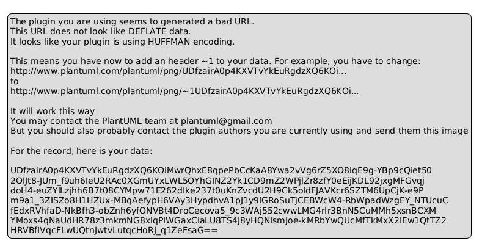
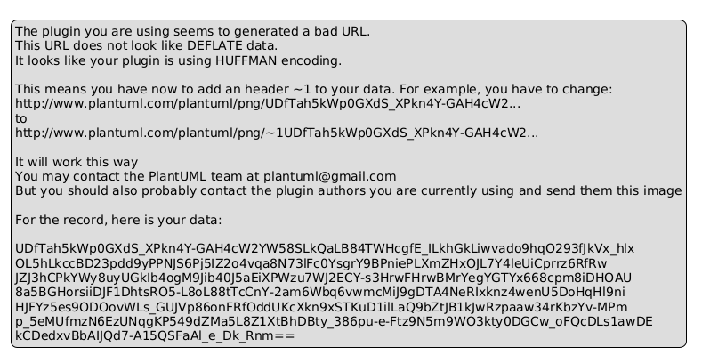
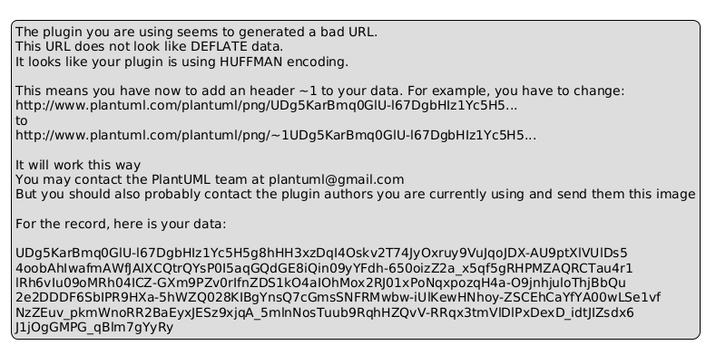
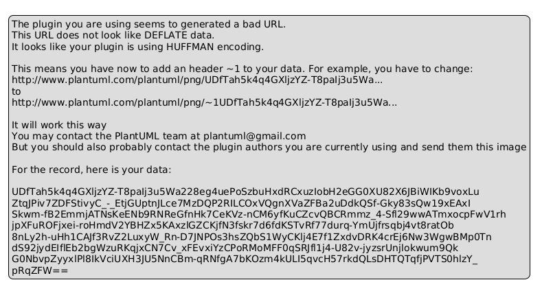
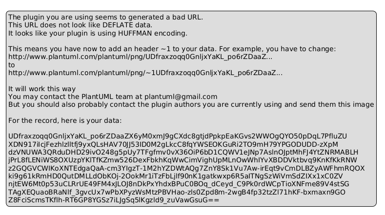
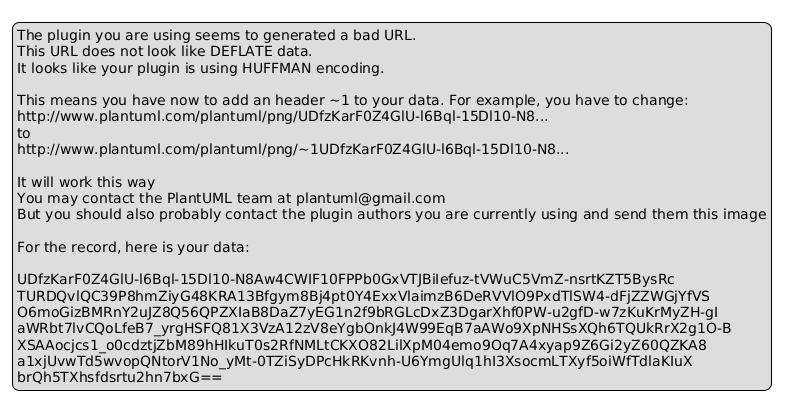

# 📊 Tài Liệu Sơ Đồ - PlantUML Diagrams

## 📋 Tổng Quan

Các sơ đồ dưới đây được tạo bằng **PlantUML** để minh hoạ kiến trúc và quy trình của hệ thống Quản lý Ra đề và Chấm thi.

---

## 🎯 1. Use Case Diagram

**Mục đích**: Hiển thị các use case (trường hợp sử dụng) chính của hệ thống

**Các Use Case chính**:
- **UC01**: Đăng nhập hệ thống
- **UC02**: Quản lý câu hỏi (CRUD)
- **UC03**: Soạn đề thi
- **UC04**: Chấm thi (nhập điểm)
- **UC05**: Tra cứu đề thi
- **UC06**: Báo cáo năm
- **UC07**: Quản lý tham số

**Actor**: Giảng viên



---

## 🗄️ 2. ER Diagram - Database Schema

**Mục đích**: Hiển thị cấu trúc database với 11 bảng chính

**Các Entity**:
1. **GIANG_VIEN** - Thông tin giảng viên
2. **MON_HOC** - Danh sách môn học
3. **DO_KHO** - Mức độ khó (Dễ, Trung bình, Khó, Phức tạp)
4. **CAU_HOI** - Ngân hàng câu hỏi
5. **DE_THI** - Đề thi
6. **CT_DETHI** - Chi tiết đề thi (N-N relationship)
7. **SINH_VIEN** - Danh sách sinh viên
8. **LOP_HOC** - Lớp học
9. **KET_QUA** - Kết quả thi của sinh viên
10. **BANG_DIEM_CHU** - Bảng quy đổi điểm (A, B+, B, C+, C, F)
11. **THAM_SO** - Tham số hệ thống

**Quan hệ chính**:
- 1 Giảng viên → nhiều Câu hỏi
- 1 Giảng viên → nhiều Đề thi
- 1 Môn học → nhiều Câu hỏi
- 1 Đề thi → nhiều Chi tiết Đề thi (CT_DETHI)
- 1 Câu hỏi → nhiều Chi tiết Đề thi
- 1 Đề thi → nhiều Kết quả
- 1 Sinh viên → nhiều Kết quả



---

## 🔧 3. Class Diagram

**Mục đích**: Hiển thị cấu trúc các class trong code

**Các Class chính**:
- `GiangVien` - Đối tượng giảng viên
- `CauHoi` - Câu hỏi
- `DeThi` - Đề thi
- `KetQua` - Kết quả thi

**Các phương thức quan trọng**:
- `GiangVien.GetCauHois()` - Lấy danh sách câu hỏi của giảng viên
- `GiangVien.GetDeThis()` - Lấy danh sách đề thi
- `DeThi.ValidateTongDiem()` - Kiểm tra tổng điểm = 10
- `CauHoi.Validate()` - Kiểm tra câu hỏi hợp lệ
- `KetQua.GetDiemChu(score)` - Quy đổi điểm số thành điểm chữ



---

## 🔄 4. Activity Diagram - Soạn Đề Thi

**Mục đích**: Minh hoạ quy trình soạn đề thi

**Các bước chính**:
1. Giảng viên chọn "Soạn đề thi"
2. Nhập thông tin đề thi (tên, môn, học kỳ, năm, thời gian)
3. Hệ thống hiển thị danh sách câu hỏi
4. Giảng viên chọn câu hỏi
5. Nhập điểm cho từng câu
6. **Validation**:
   - ✓ Tổng điểm phải = 10 điểm
   - ✓ Số câu hỏi phải ≥ giới hạn tối thiểu
7. Lưu đề thi vào database
8. Thông báo thành công

**Decision Points**:
- Tổng điểm = 10? (If No → quay lại chỉnh sửa)
- Số câu ≥ tối thiểu? (If No → chọn thêm câu)



---

## 📞 5. Sequence Diagram - Đăng Nhập

**Mục đích**: Minh hoạ luồng gửi nhận thông điệp giữa các component khi đăng nhập

**Các bước chính**:
1. Giảng viên nhập MaGV và MatKhau
2. Browser gửi POST request đến LoginController
3. Controller validate dữ liệu
4. Nếu hợp lệ → query database để kiểm tra giảng viên
5. Verify mật khẩu
6. Nếu mật khẩu đúng → lưu Session và redirect tới Home

**Actors**: 
- Giảng viên
- Web Browser
- LoginController
- SQL Server Database



---

## 🏗️ 6. Deployment Diagram - Kiến trúc 3-Tier

**Mục đích**: Hiển thị kiến trúc hệ thống toàn bộ

**Ba Layer chính**:

### **1. Presentation Layer**
- Web Browser
- HTML/CSS/JavaScript

### **2. Application Layer**
- ASP.NET MVC 5
- Controllers (xử lý logic)
- Views (hiển thị)
- Business Logic

### **3. Data Layer**
- Entity Framework 6 (ORM)
- Models (đối tượng dữ liệu)
- LINQ Queries (truy vấn)
- SQL Server 2019 Database

**Luồng dữ liệu**:
```
Browser → ASP.NET MVC → Entity Framework → SQL Server → trả về kết quả
```



---

## 📝 PlantUML Code Reference

### Cài đặt PlantUML

**macOS (Homebrew)**:
```bash
brew install plantuml
```

**Ubuntu/Debian**:
```bash
sudo apt-get install plantuml
```

**Windows (Chocolatey)**:
```powershell
choco install plantuml
```

### Tạo Diagram từ Code

**Cách 1: Dùng lệnh PlantUML local**:
```bash
plantuml diagram.puml -o output.png
```

**Cách 2: Sử dụng Online Editor**:
- URL: http://www.plantuml.com/plantuml/uml/
- Copy code PlantUML → Generate → Download

**Cách 3: Sử dụng VS Code Extension**:
- Cài "PlantUML" extension
- Ctrl+Shift+P → "PlantUML: Preview"

---

## 📊 Các Format Diagram Được Hỗ Trợ

PlantUML hỗ trợ tạo các loại sơ đồ sau:

| Sơ Đồ | Lệnh | Mô Tả |
|-------|------|-------|
| Use Case | `@startuml` ... `@enduml` | Hiển thị các chức năng |
| Class | `class ClassName { }` | Cấu trúc class |
| Sequence | `participant Actor` | Tương tác giữa các object |
| Activity | `start` ... `stop` | Quy trình/workflow |
| ER/Entity | `entity EntityName` | Schema database |
| Component | `component Component` | Kiến trúc hệ thống |
| Deployment | `node NodeName` | Triển khai hệ thống |
| State | `state State` | Máy trạng thái |
| Timing | `clock CLK` | Biểu đồ thời gian |

---

## 🎨 Styling trong PlantUML

**Themes**:
```plantuml
!theme cerulean-outline
!theme aws-orange
!theme plain
```

**Colors**:
```plantuml
skinparam backgroundColor #F0F0F0
skinparam classBackgroundColor #E1F5FF
skinparam classBorderColor #01579B
```

**Font Settings**:
```plantuml
skinparam font monospaced
skinparam fontSize 14
```

---

## 🔗 Quan hệ Diagram và Báo Cáo

| Chương | Diagram Liên Quan |
|--------|-------------------|
| Chương 2: Xác định yêu cầu | Use Case Diagram |
| Chương 3: Phân tích yêu cầu | Use Case, Activity Diagram |
| Chương 4: Thiết kế hệ thống | Architecture, Deployment Diagram |
| Chương 5: Thiết kế đối tượng | Class Diagram |
| Chương 6: Thiết kế dữ liệu | ER Diagram |
| Chương 7: Thiết kế giao diện | Sequence Diagram |
| Chương 8: Cài đặt | Deployment Diagram |
| Chương 9: Kiểm thử | Activity Diagram |

---

## 📦 Các File Liên Quan

```
QuanLyRaDeChamThi/BaoCao/
├── diagrams/
│   ├── 01-UseCase.png              # Use Case Diagram
│   ├── 02-Database-ER.png          # ER Diagram
│   ├── 03-ClassDiagram.png         # Class Diagram
│   ├── 04-Activity-CreateExam.png  # Activity Diagram
│   ├── 05-Sequence-Login.png       # Sequence Diagram
│   └── 06-Architecture.png         # Architecture Diagram
├── BAO_CAO_HOAN_CHINH.docx                    # Báo cáo gốc
├── BAO_CAO_HOAN_CHINH_VOI_DIAGRAM.docx        # Báo cáo có diagram ⭐
├── DIAGRAMS_DOCUMENTATION.md                  # File này
└── [các file markdown khác...]
```

---

## 💡 Tips & Tricks

### 1. Cách in Diagram đẹp

```bash
# In với độ phân giải cao (SVG)
plantuml diagram.puml -tsvg

# In với kích thước tùy chỉnh
plantuml diagram.puml -DscaleFactor=2.0
```

### 2. Tối ưu hóa kích thước file

```plantuml
!define SMALL
!include <C4/C4_Context>
' Sử dụng compact mode
```

### 3. Tạo Diagram động

```plantuml
!include <C4/C4_Container>
System(WebApp, "Web Application", "ASP.NET MVC")
Database(DB, "Database", "SQL Server")
Person(User, "Giảng viên")
```

---

## 📚 Tham khảo thêm

- 📖 PlantUML Documentation: http://plantuml.com
- 🎨 PlantUML Themes: https://www.plantuml.com/plantuml/uml/
- 💻 VS Code Extension: https://marketplace.visualstudio.com/items?itemName=jebbs.plantuml

---

*Tài liệu này được tạo tự động bằng PlantUML. Cập nhật lần cuối: 2026-05-17*
