# HƯỚNG DẪN TẠO SƠ ĐỒ PLANTUML TỰ ĐỘNG

## Giới thiệu

File này chứa:
1. **PlantUML code** cho tất cả sơ đồ trong báo cáo
2. **Python script** tự động generate PNG images
3. **Hướng dẫn** cài đặt và sử dụng

---

## Cài đặt PlantUML

### Phương pháp 1: Cài Java + PlantUML.jar

```powershell
# Cài Java
choco install openjdk11

# Tải PlantUML.jar
Invoke-WebRequest -Uri "https://sourceforge.net/projects/plantuml/files/plantuml.jar/download" -OutFile plantuml.jar

# Test
java -jar plantuml.jar -version
```

### Phương pháp 2: Cài VS Code Extension

```
1. Mở VS Code
2. Cài extension: "PlantUML" by jebbs
3. Ctrl+Shift+P → "PlantUML: Install"
```

### Phương pháp 3: Online Editor

- URL: http://www.plantuml.com/plantuml/uml/
- Copy code vào → Generate → Download PNG

---

## PlantUML Code cho từng sơ đồ

### 1. Use Case Diagram

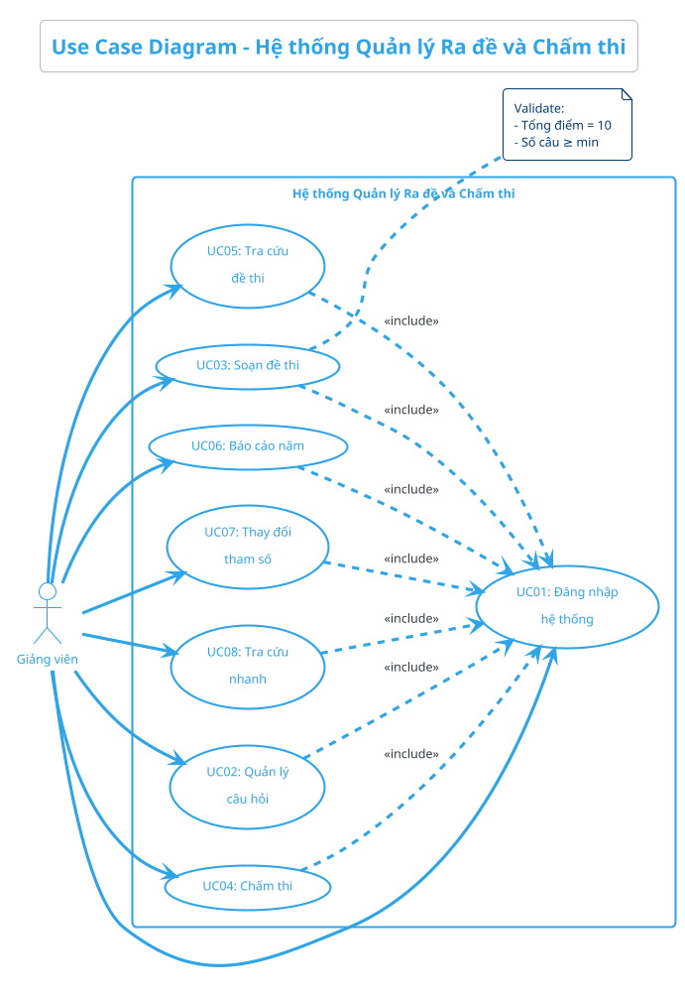

### 2. Class Diagram

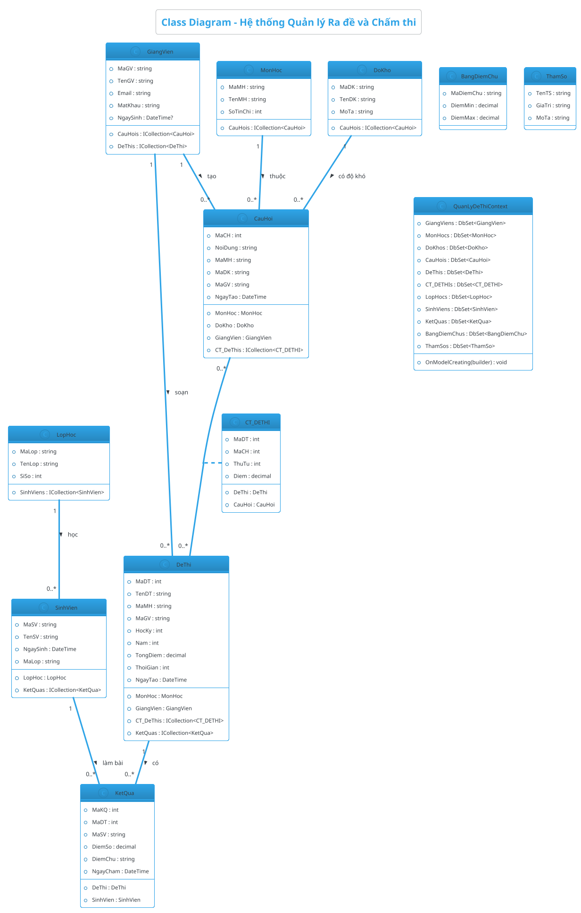

### 3. Sequence Diagram - Login

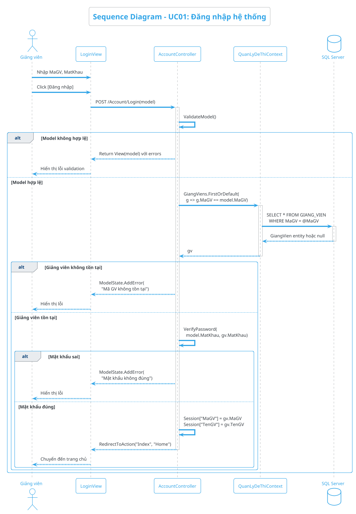

### 4. Sequence Diagram - Create Question

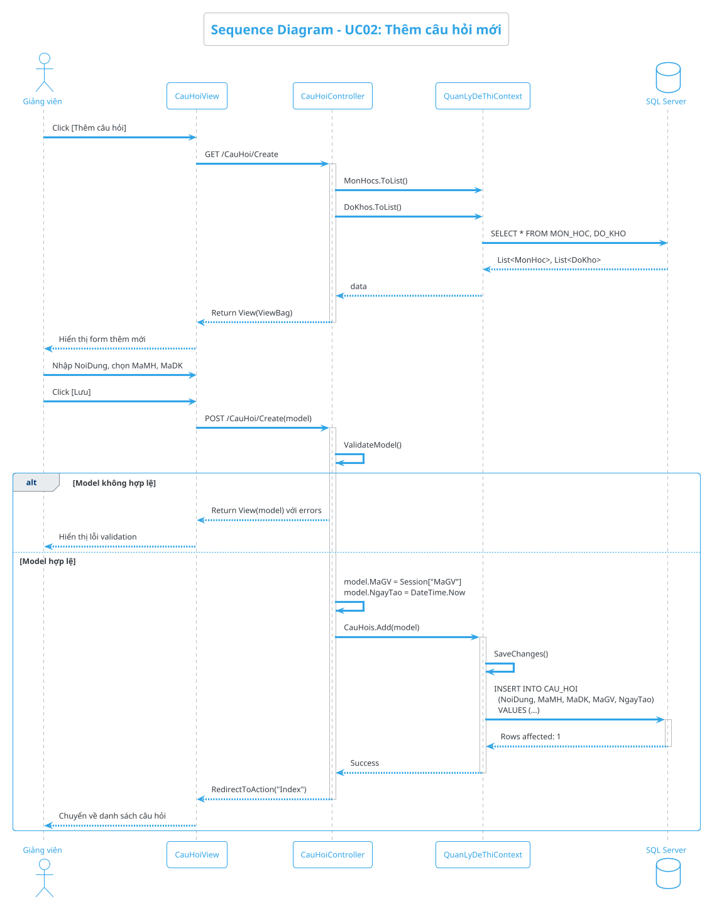

### 5. Sequence Diagram - Create Exam

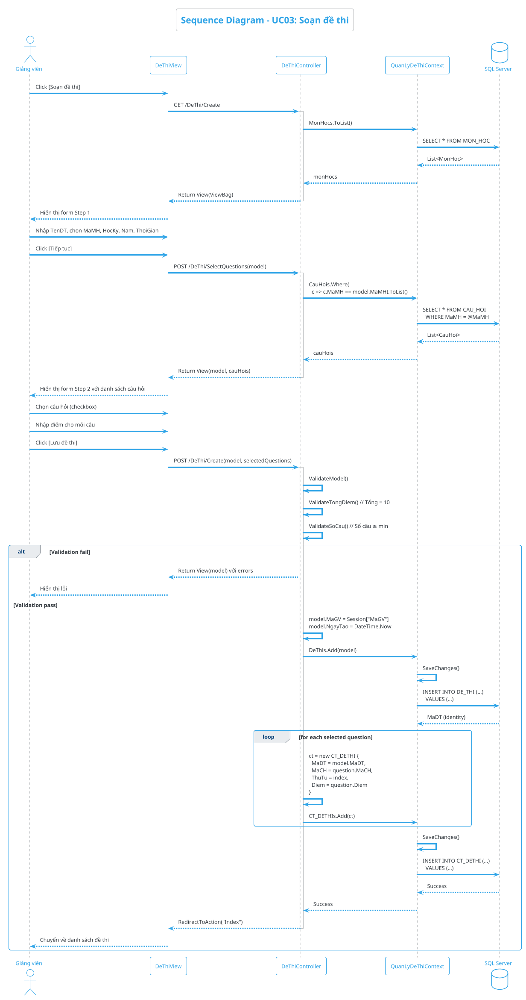

### 6. Sequence Diagram - Grading

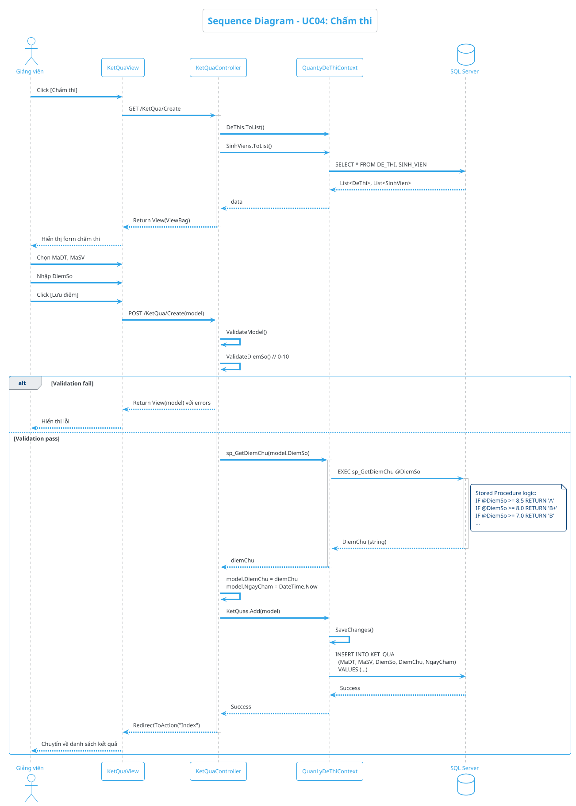

### 7. Sequence Diagram - Annual Report

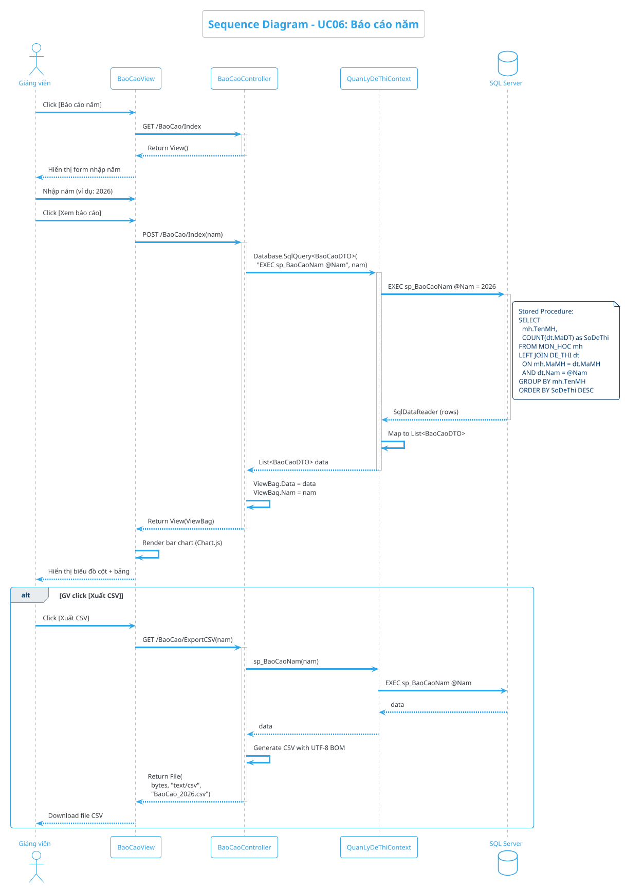

### 8. Activity Diagram - Create Question

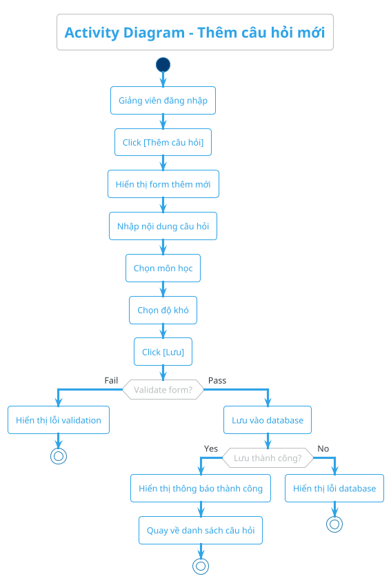

### 9. Activity Diagram - Create Exam

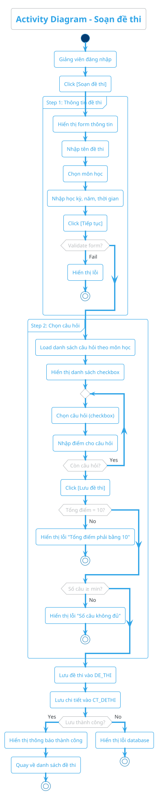

### 10. Component Diagram

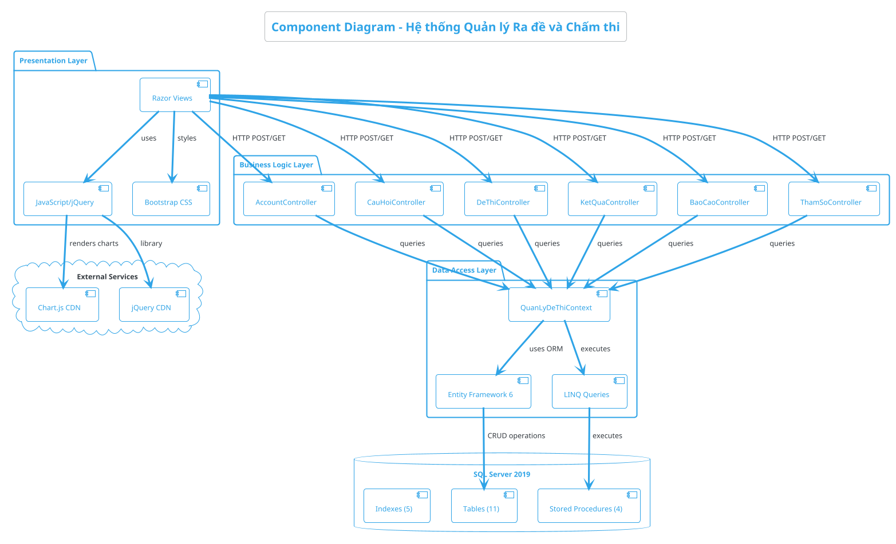

### 11. Deployment Diagram

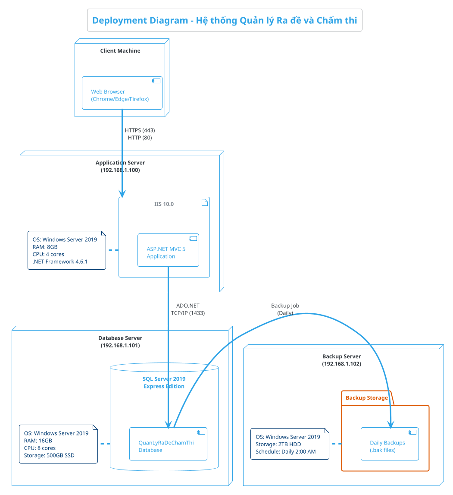

### 12. ERD (Entity Relationship Diagram)

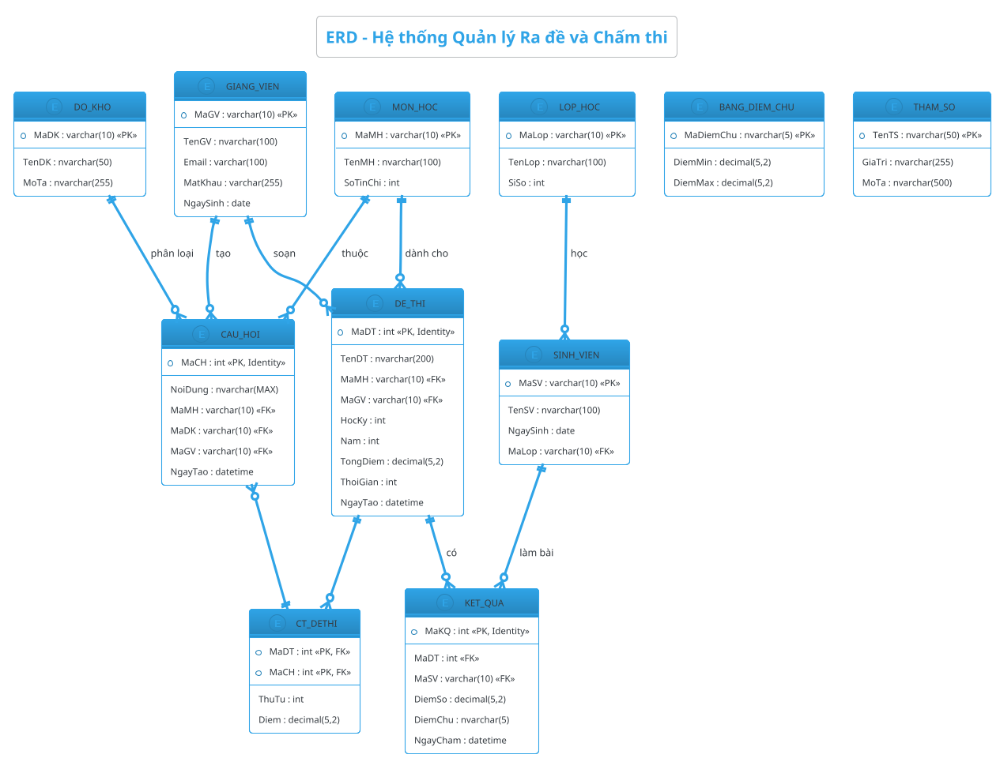

---

## Python Script tự động generate

Tạo file `generate_diagrams.py`:

```python
#!/usr/bin/env python3
"""
Script tự động generate tất cả PlantUML diagrams
Yêu cầu: Java + plantuml.jar
"""

import os
import subprocess
from pathlib import Path

# Cấu hình
PLANTUML_JAR = "plantuml.jar"  # Đường dẫn đến plantuml.jar
DIAGRAMS_DIR = Path(__file__).parent / "diagrams"
OUTPUT_DIR = DIAGRAMS_DIR / "output"

# Danh sách các diagram files
DIAGRAM_FILES = {
    "UseCase": "01_UseCase_QuanLyRaDeChamThi.puml",
    "ClassDiagram": "02_ClassDiagram_QuanLyRaDeChamThi.puml",
    "Sequence_Login": "03_Sequence_Login.puml",
    "Sequence_CreateQuestion": "04_Sequence_CreateQuestion.puml",
    "Sequence_CreateExam": "05_Sequence_CreateExam.puml",
    "Sequence_Grading": "06_Sequence_Grading.puml",
    "Sequence_AnnualReport": "07_Sequence_AnnualReport.puml",
    "Activity_CreateQuestion": "08_Activity_CreateQuestion.puml",
    "Activity_CreateExam": "09_Activity_CreateExam.puml",
    "Component": "10_Component_QuanLyRaDeChamThi.puml",
    "Deployment": "11_Deployment_QuanLyRaDeChamThi.puml",
    "ERD": "12_ERD_QuanLyRaDeChamThi.puml",
}


def check_plantuml():
    """Kiểm tra PlantUML có sẵn không"""
    if not Path(PLANTUML_JAR).exists():
        print(f"❌ Không tìm thấy {PLANTUML_JAR}")
        print("   Tải từ: https://sourceforge.net/projects/plantuml/files/plantuml.jar/download")
        return False
    
    try:
        result = subprocess.run(
            ["java", "-version"],
            capture_output=True,
            text=True
        )
        if result.returncode != 0:
            print("❌ Java chưa được cài đặt")
            print("   Cài đặt: choco install openjdk11")
            return False
    except FileNotFoundError:
        print("❌ Java chưa được cài đặt")
        return False
    
    return True


def generate_diagram(puml_file, output_format="png"):
    """Generate 1 diagram từ .puml file"""
    input_path = DIAGRAMS_DIR / puml_file
    
    if not input_path.exists():
        print(f"⚠️  File không tồn tại: {puml_file}")
        return False
    
    cmd = [
        "java",
        "-jar",
        PLANTUML_JAR,
        "-t" + output_format,  # png, svg, eps
        "-o",
        str(OUTPUT_DIR.absolute()),
        str(input_path.absolute())
    ]
    
    try:
        result = subprocess.run(cmd, capture_output=True, text=True)
        if result.returncode == 0:
            output_file = OUTPUT_DIR / input_path.with_suffix(f".{output_format}").name
            print(f"✅ Generated: {output_file.name}")
            return True
        else:
            print(f"❌ Error generating {puml_file}:")
            print(result.stderr)
            return False
    except Exception as e:
        print(f"❌ Exception: {e}")
        return False


def generate_all_diagrams(output_format="png"):
    """Generate tất cả diagrams"""
    print("🚀 Bắt đầu generate PlantUML diagrams...")
    print(f"📁 Output directory: {OUTPUT_DIR}")
    print(f"📊 Format: {output_format.upper()}")
    print("=" * 60)
    
    # Tạo thư mục output nếu chưa có
    OUTPUT_DIR.mkdir(parents=True, exist_ok=True)
    
    success_count = 0
    fail_count = 0
    
    for name, puml_file in DIAGRAM_FILES.items():
        print(f"\n📐 {name}...")
        if generate_diagram(puml_file, output_format):
            success_count += 1
        else:
            fail_count += 1
    
    print("\n" + "=" * 60)
    print(f"✅ Thành công: {success_count}/{len(DIAGRAM_FILES)}")
    print(f"❌ Thất bại: {fail_count}/{len(DIAGRAM_FILES)}")
    print(f"📁 Xem kết quả tại: {OUTPUT_DIR}")


def main():
    """Main function"""
    print("=" * 60)
    print("   PlantUML Diagram Generator")
    print("   Hệ thống Quản lý Ra đề và Chấm thi")
    print("=" * 60)
    
    # Kiểm tra dependencies
    if not check_plantuml():
        print("\n⚠️  Vui lòng cài đặt Java và tải plantuml.jar")
        return
    
    # Generate diagrams
    print("\n✅ Java và PlantUML đã sẵn sàng!")
    
    # Chọn format
    print("\nChọn output format:")
    print("  1. PNG (default)")
    print("  2. SVG (vector, scalable)")
    print("  3. EPS (for LaTeX)")
    
    choice = input("\nLựa chọn (1-3, Enter = PNG): ").strip()
    
    format_map = {
        "1": "png",
        "2": "svg",
        "3": "eps",
        "": "png"
    }
    
    output_format = format_map.get(choice, "png")
    
    # Generate
    generate_all_diagrams(output_format)
    
    print("\n🎉 Hoàn thành!")


if __name__ == "__main__":
    main()
```

---

## Hướng dẫn sử dụng

### Bước 1: Chuẩn bị môi trường

```powershell
# Cài Java
choco install openjdk11

# Tải PlantUML.jar
cd "c:\Users\UDT4HC\Downloads\CNPM new\Project\QuanLyRaDeChamThi"
Invoke-WebRequest -Uri "https://sourceforge.net/projects/plantuml/files/plantuml.jar/download" -OutFile plantuml.jar
```

### Bước 2: Tạo thư mục diagrams

```powershell
mkdir diagrams
mkdir diagrams\output
```

### Bước 3: Copy PlantUML code

Copy từng đoạn code PlantUML ở trên vào các file:
- `diagrams/01_UseCase_QuanLyRaDeChamThi.puml`
- `diagrams/02_ClassDiagram_QuanLyRaDeChamThi.puml`
- ... (12 files)

### Bước 4: Generate diagrams

```powershell
# Chạy Python script
python generate_diagrams.py

# Hoặc generate thủ công
java -jar plantuml.jar -tpng -o "diagrams/output" "diagrams/*.puml"
```

### Bước 5: Sử dụng trong báo cáo

```markdown
# Trong file .md

```

---

## Tips

### 1. Preview trong VS Code

- Cài extension "PlantUML"
- Mở file .puml
- Nhấn `Alt+D` để xem preview

### 2. Generate multiple formats

```powershell
# PNG + SVG + EPS cùng lúc
java -jar plantuml.jar -tpng -tsvg -teps -o "output" "*.puml"
```

### 3. Custom themes

```plantuml
!theme cerulean-outline  ' Xanh dương
!theme amiga             ' Retro
!theme sketchy-outline   ' Hand-drawn style
```

### 4. Export to Word/PDF

- Generate PNG với resolution cao
- Insert vào Word: Insert → Pictures
- Trong Pandoc: Images tự động embed

---

## Troubleshooting

**Q: "java: command not found"**
```powershell
# Cài Java
choco install openjdk11
```

**Q: "Error reading plantuml.jar"**
```powershell
# Tải lại
Invoke-WebRequest -Uri "https://sourceforge.net/projects/plantuml/files/plantuml.jar/download" -OutFile plantuml.jar
```

**Q: "Syntax error in .puml file"**
```
→ Kiểm tra lại code PlantUML
→ Preview trong VS Code để debug
```

**Q: "PNG quá nhỏ"**
```powershell
# Tăng DPI
java -DPLANTUML_LIMIT_SIZE=8192 -jar plantuml.jar -tpng *.puml
```